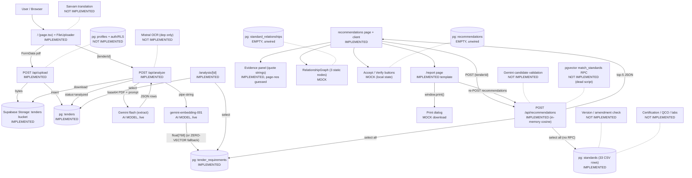

# SIH26108 — Complete Internal Technical Audit (Forensic, Read-Only)

> Scope: current prototype codebase as committed (4 commits, `f1a5341` HEAD). No code was modified for this audit; every claim cites the file and line inspected. This document describes what the code ACTUALLY does — not what the spec or UI implies.

# EXECUTIVE SUMMARY

The prototype is a **working vertical slice of 3 of the 6 UI steps**: PDF upload → Gemini requirement extraction → in-memory vector matching → evidence display → print-based report. The genuinely real parts are: Supabase Storage upload + `tenders` row (`src/app/api/upload/route.ts`), single-shot Gemini PDF extraction + `gemini-embedding-001` embeddings stored in `tender_requirements` (`src/app/api/analyze/route.ts`), and a brute-force cosine-similarity matcher over 33 curated standards (`src/app/api/recommendations/route.ts`). Everything else the UI implies — **Gemini validation of candidates, pgvector RPC search, Mistral OCR, Sarvam translation, persisted human review, related-standards graph data, version/amendment checking, certification data, real PDF/DOCX export** — is either hardcoded, dead UI, or absent.

# 1. CURRENT USER FLOW

Actual client routes (from `git ls-files`; there is no `/dashboard`, `/standards`, `/help`, `/analyses` page):

1. `/` (`src/app/page.tsx`) → renders `Header` + `FileUploader`. Upload + analyze happen back-to-back here, then `router.push(/analysis/[id])`.
2. `/analysis/[id]` (`src/app/analysis/[id]/page.tsx`) → server component; reads `tenders` + `tender_requirements` from Supabase; renders requirement cards; button to recommendations (disabled unless `status==='analyzed'` and requirements exist).
3. `/analysis/[id]/recommendations` → server shell (`recommendations/page.tsx`) + `RecommendationsClient.tsx` (client). POSTs to `/api/recommendations` on mount, shows candidate list + evidence panel + `RelationshipGraph` + Accept / Needs Verification buttons + "Generate Report" link.
4. `/analysis/[id]/report` → server shell (`report/page.tsx`, fetches tender name only) + `ReportContentClient.tsx` (re-POSTs `/api/recommendations` on mount, renders report) + `ReportActionsClient.tsx` (Print / Download PDF = both `window.print()`).

Dead navigation: `Header.tsx:71` links to `/help` — no such route exists (404). `RecommendationsClient.tsx:151` "Optional BIS URL" has `href="#"`.

# 2. CURRENT SYSTEM ARCHITECTURE

Real stage-by-stage flow:

| # | Stage | Handler (file) | Technique | Result → next stage |
|---|---|---|---|---|
| 1 | Upload UI | `FileUploader.tsx:20-64`, `POST /api/upload` | plain fetch, no client processing | File → `{tenderId}` → analyze |
| 2 | Upload server | `api/upload/route.ts:8-50` | Supabase Storage + Postgres insert | `tenders` row + PDF bytes → analyze |
| 3 | Analyze trigger | `FileUploader.tsx:45-51`, `POST /api/analyze` | fetch `{tenderId}` | `{success, count}` → analysis page |
| 4 | PDF → requirements | `api/analyze/route.ts:80-183`, Gemini inlineData | LLM + fallback chain, no OCR/chunking | JSON rows → `tender_requirements` |
| 5 | Embed requirements | same file `:149-172`, `embedContent` | `gemini-embedding-001` → 768-d; zero-vector fallback | `tender_requirements.embedding` |
| 6 | Retrieval | `api/recommendations/route.ts:21-95` | in-memory cosine, `>0.65`, top 5 | JSON candidates (nothing stored) |
| 7 | Relevance label | same file `:79-82` | hardcoded `>0.8` High / `>0.70` Medium / Low | display only |
| 8 | Evidence panel | `RecommendationsClient.tsx:122-147` | string templating, no LLM | quotes shown; pages/URLs absent |
| 9 | Related graph | `graph/RelationshipGraph.tsx:12-34` | hardcoded React Flow trio | static; node clicks do nothing |
| 10 | Review | `RecommendationsClient.tsx:158-171` | React `acceptedIds` state only | **persisted nowhere**; report ignores it |
| 11 | Report | `report/ReportContentClient.tsx` + `ReportActionsClient.tsx` | re-POSTs recommendations; `window.print()` | printable HTML; terminal |

# 3. UPLOAD PIPELINE

- Component: `src/components/upload/FileUploader.tsx`. `<input type="file" accept="application/pdf">` (`:71-77`). **No client-side type enforcement beyond the picker filter, no size check** — "PDF (Max 50MB)" (`:83`) is label text only; file size is only displayed.
- `handleUploadAndAnalyze` (`:20-64`): POSTs FormData → `/api/upload`, then immediately POSTs `{tenderId}` → `/api/analyze`, then `router.push('/analysis/${tenderId}')` (`:57`). Upload and analysis are serially coupled in the click handler; there is no background job/queue.
- Server `src/app/api/upload/route.ts:8-50`: reads `formData.get('file')`; **no MIME validation, no size validation**. Generates `uploads/${random}_${Date.now()}.${ext}` (`:16-19`), uploads via service-role client to Storage bucket `tenders` (`:22-24`), inserts `tenders{filename, storage_path, page_count:0, status:'uploaded'}` (`:31-40`), returns `{tenderId}`.
- Actual persisted structure in `tenders`: `{id (uuid), filename (original name), storage_path, page_count: 0 (never updated afterward), status, created_at, created_by: NULL (never set)}`.
- **No PDF parsing, no OCR, no text extraction at upload stage.** No page numbers or source locations retained here — the original PDF bytes persist in the bucket; nothing else.
- Failure: any throw → `{error: err.message}` 500; client shows it in a red box (`FileUploader.tsx:87-91`). Invalid/non-PDF files are accepted by the route (bucket policy from one-time script `scripts/setup_storage.ts:10-15` declares `allowedMimeTypes:['application/pdf']` + 50 MB, but the route itself enforces nothing).

# 4. REQUIREMENT EXTRACTION

1. **LLM? Yes.** `src/app/api/analyze/route.ts:129` sends the whole PDF as base64 `inlineData{mimeType:"application/pdf"}` to Gemini.
2. **Model:** `GEMINI_MODEL` env or default `'gemini-3.8-flash'` (`:8`), with fallbacks `['gemini-2.0-flash','gemini-1.5-flash','gemini-1.5-pro']` (`:19-24`). Retry: up to 3 attempts on 429/500/503 with 4s×attempt backoff; 404/400 → next fallback model (`generateContentWithRetry`, `:43-78`).
3. **Prompt visible? Yes**, verbatim at `:105-123`: "You are an expert procurement and technical standards extractor… Return the results as a JSON array… Respond with ONLY the raw JSON array."
4. **Schema enforcement:** weak. Strips ```` ```json ```` fences (`:132-134`), then bare `JSON.parse` (`:136`). No Zod/schema validation; rows with falsy `requirement`/`value` are skipped (`:149`).
5. **No unit normalization** — `unit` is free LLM text. **No confidence** — `confidence` column exists in DB but is never written. **No product/material/electrical/structural categorization logic** — `category` is free LLM text (prompt example: "Electrical / Physical / Safety / etc").
6. **Source quotation retained:** `source_text` stored per row (`:168`). **Page numbers NOT real:** `page_number: req.page_number || 1` (`:169`) — the model sees one undifferentiated PDF blob (no per-page splitting), so page numbers are LLM guesses.
7. **User editing? No.** `analysis/[id]/page.tsx:94-107` renders read-only cards; no inputs, no PATCH/PUT endpoint exists (only 3 API routes total). Consequently nothing downstream recomputes from edits.
8. Embedding text format actually used (`:151`): `` `${category} | ${requirement} | ${value} | ${source_text}` `` — close to but not identical with the spec's `NUMBER|TITLE|SECTOR|KEYWORDS|SCOPE|CUES` format (that format is only used for standards seeding).

# 5. STANDARDS CORPUS

- **Source: one local CSV**, `indian_standards_prototype.csv` (34 lines = header + **33 records**), seeded into Supabase via `scripts/seed_standards.ts` (`npm run seed`). No scraper, no BIS API, no live sync.
- **Actual CSV columns (14):** `id, standard_id, title, department, sector, keywords, scope_summary, requirement_cues, status_for_demo, applicability, prototype_note, source, source_url, embedding_text`. Every row's `status_for_demo` = `candidate`; `source_url` is identically `https://www.bis.gov.in/know-your-standard/?lang=en` on all 33 rows (generic portal link, not per-standard).
- **DB `standards` columns actually populated:** `standard_number, title, department, sector, keywords (text[] split on ';'), scope_summary, requirement_cues, status (← status_for_demo), source_url, prototype_note, embedding (vector(768))`. `year, amendments, supersedes` columns exist in schema but the seeder **never writes them** → always NULL.
- **NOT stored anywhere:** clauses, full document text, test methods, certification info, categories beyond `sector`/`department` strings, normative references (table exists, zero rows written by any code path).
- **Coverage:** 14 Civil/Construction (IS 456, 800, 875 ×4, 1893, 13920, 10262, 383, 1786, 269, 516, 4031), 7 Electrical (IS 694, 732, 3043, 1646, 1180, 10028 ×2), 2 Water & Plumbing + 3 water/food + 3 steel/manufacturing + 3 management-system (9001/14001/45001) + 1 accessibility (IS 17017). Sectors are free-text with inconsistent granularity ("Water" vs "Water / Food" vs "Water & Plumbing"). **Demo-scale, manually curated** — e.g. row 19's prototype_note even admits "BIS search result shows a fourth revision in 2025; verify exact current edition before use."
- **Count check:** `SELECT count` would return ≤33 minus skips (seeder skips existing numbers and rows without `embedding_text`).

# 6. RETRIEVAL ENGINE

Exact sequence in `src/app/api/recommendations/route.ts`:

1. Fetch all `tender_requirements` for tender (`:28-31`); throw if zero.
2. Fetch **entire** `standards` table (`id, standard_number, title, embedding, scope_summary, requirement_cues`) (`:39-41`) — no filter, no pagination.
3. For each requirement × each standard: parse embedding (string or array, `:50`/`:54`), skip empties, `cosineSimilarity` (`:8-19`, standard dot/sqrt, zero-norm → 0).
4. Keep pairs with `sim > 0.65` (`:59`) in a `Map` keyed by standard id, accumulating `matchedReqs[]` and `maxSimilarity` (`:60-73`).
5. Sort desc by `maxSimilarity`, `slice(0, 5)` (`:76`).

So: **embedding model** `gemini-embedding-001` truncated to 768 (`analyze/route.ts:157`, `seed_standards.ts:80`); **metric** cosine; **top-K = 5** after threshold; **no keyword search, no hybrid search, no metadata filtering, no reranker, no per-category grouped retrieval** (spec §36's Product/Material/Safety grouped retrieval is not implemented). **pgvector is storage only** — the `match_standards` RPC in `scripts/setup_rpc.ts:9-27` is dead code (`setup()` never invoked; comment at `:29-31` admits they do JS similarity instead), and `supabase.rpc` appears nowhere in `src/`. Complexity is O(R×33) — fine for demo, no vector index exists in migration (no `CREATE INDEX` at all).

# 7. RELEVANCE / RANKING ENGINE

Single signal: max cosine similarity across the tender's requirements. Code (`recommendations/route.ts:79-82`):

```
relevance = 'Low'; if (maxSimilarity > 0.8) 'High'; else if (> 0.70) 'Medium'
```

No LLM validation call exists anywhere in the recommendation path (the spec's "Gemini validates candidates" step is absent — the only Gemini calls in the repo are extraction + embeddings). No Jev/Laya/rules combination. "Potentially applicable / weak_match / insufficient_evidence" vocabulary from the spec never appears in code.

**The "76%" question:** there is no real percentage anywhere in the pipeline. Two display artifacts mimic one: (a) `ai_note` embeds the raw cosine as percent — `` `Candidate identified via vector search score: ${(maxSimilarity*100).toFixed(1)}%` `` (`:91`) — so "83.2%" = cosine×100, **not a probability or applicability claim**; (b) worse, the report page shows `` `Semantic retrieval similarity: ${relevance==='high' ? '0.76' : '0.68'}` `` (`ReportContentClient.tsx:138`) — **a hardcoded constant** chosen by label, not computed from anything.

# 8. EVIDENCE / TRACEABILITY

Half-genuine. The `source_text` quote originates from the LLM extraction of the actual uploaded PDF and is stored per requirement (`tender_requirements.source_text`), then surfaced as `tender_evidence: Tender Source: "<quote>"` (`recommendations/route.ts:90`, rendered at `RecommendationsClient.tsx:127-131` and in the report at `ReportContentClient.tsx:109-116`). So the *words* are traceable to the tender.

But: **no page/section/clause linkage is real** — `page_number` is an LLM guess from a whole-document blob (see §4.6); the UI never even renders page numbers. No link to standard metadata beyond `scope_summary` in `ai_note`; **no source-document or per-standard URL** (the only URL affordance is `href="#"`, `RecommendationsClient.tsx:150-154`). "View Evidence" is a button that merely re-selects the already-selected card (`:96-104`). Verdict: quote-level traceability to tender text is genuine; everything structural (page, section, clause, standard source) is UI text without backing data.

# 9. NORMATIVE / RELATED STANDARDS GRAPH

Brutally honest: **fully static demo widget.**

- Library: React Flow (`RelationshipGraph.tsx:3`, `import ReactFlow…`, package `reactflow ^11.11.4`). No NetworkX/D3/DB graph.
- Nodes (`:12-29`, `useMemo`): center node = selected `standardNumber` prop; satellites **always** `IS 10322 (Part 1)` and `IS 16102` regardless of selection. Edges (`:31-34`): `Reference` (animated) and `Related` — fixed.
- `standard_relationships` table (with `relationship_type, evidence, source_url`) is **never read or written** by any `src/` code (grep: zero hits). No relationship types exist in code. No BIS reference data is used.
- "Dynamically changes": only the center label changes; topology is identical for every standard.
- Node click: **nothing happens** — no `onNodeClick`, nodes aren't linked to detail views, no multi-level traversal possible.
- The "(Demo)" suffix in the section heading (`RecommendationsClient.tsx:141`) is the code's own admission.

# 10. VERSION / AMENDMENT CHECKING

**Not implemented.** Grep for `amendment|supersede|withdrawn|version|edition|reaffirm` in `src/` returns zero hits. The DB has `standards.year/amendments/supersedes/status` columns and the CSV has year-like suffixes in `standard_id` (e.g. `:2000`), but the seeder never writes year/amendments/supersedes (all NULL), and no UI or API reads them. The only version-adjacent behavior is disclaimer copy ("verify current BIS status", "verify latest edition" inside CSV `prototype_note` strings). No live check, no update mechanism, no staleness logic.

# 11. CERTIFICATION / REGULATORY LOGIC

**Not implemented.** Grep for `certification|QCO|CRS|hallmark|lab` in `src/` returns only BIS-verification disclaimer sentences. No certification fields in CSV/schema (closest is one CSV note on IS 14543 mentioning "mandatory certification" as free text). No testing-requirement, QCO, CRS, or hallmarking retrieval, LLM, or hardcoded module exists.

# 12. REPORT GENERATION

- Route/page: `analysis/[id]/report/page.tsx` (server: fetches tender row for `filename` only) + `ReportContentClient.tsx` (client).
- Logic: on mount, **re-POSTs `/api/recommendations`** (`ReportContentClient.tsx:14-18`) — the report is recomputed live, not read from stored review state. Sections: title block (tender name + `new Date().toLocaleDateString()`), Summary counters, Accepted Standards list (evidence + reasoning + matched requirements + hardcoded similarity line).
- **Review logic is fake:** `totalCandidates = recommendations.length; accepted = recommendations.length; needsVerification = 0` (`:55-57`) — the report always claims 100% accepted regardless of the Accept/Reject buttons (which persist nothing, §2). There is no accepted/rejected/verification branching.
- **No backend route, no persistence** (no report table), **no PDF/DOCX library** — `ReportActionsClient.tsx:7-17`: `handlePrint` and `handleDownloadPdf` both call `window.print()`. "Download PDF" = browser print dialog. Fields 1–12 of the spec's report structure are partially covered (tender info, requirements indirectly, recommendations, reasons, evidence, disclaimer) but related standards, review decisions, and source links are absent or dead.

# 13. DATABASE

- Tech: Supabase-hosted PostgreSQL + pgvector (`vector(768)`), one migration `supabase/migrations/01_init.sql` (85 lines). No indexes, no RLS policies, no RPC functions, no seed data in migration.
- Tables: `profiles` (unused — no auth; `tenders.created_by` always NULL), `tenders`, `tender_requirements` (`embedding vector(768)`, `confidence` never written), `standards` (`embedding vector(768)`, `keywords text[]`, `amendments/supersedes text[]` never written), `standard_relationships` (never touched), `recommendations` (**never inserted/updated/selected** by app code — verified by grep).
- Relations: `tender_requirements.tender_id → tenders`, `recommendations.tender_id/standard_id`, `standard_relationships.source/target → standards`, all `ON DELETE CASCADE` where applicable; `profiles.id → auth.users(id)`.
- Actual persistence graph is therefore: `tenders 1—N tender_requirements`, plus a standalone `standards` corpus. The review/report half of the schema (`recommendations`, `standard_relationships`, `profiles`) is **designed but unwired**.
- Storage: `tenders` bucket (private, PDF-only, 50 MB) via one-time `scripts/setup_storage.ts`. App up/downloads with the service-role key; no signed URLs.

# 14. AI / ML MODELS

| Model / Service | Purpose | Input | Output | Where called | Status |
|---|---|---|---|---|---|
| Gemini generative (`GEMINI_MODEL` default `gemini-3.8-flash`; fallbacks 2.0-flash/1.5-flash/1.5-pro) | Tender requirement extraction | Full PDF as base64 inlineData + prompt | JSON array `{category, requirement, value, unit, source_text, page_number}` | `api/analyze/route.ts:129` | **Live, working** (retry+fallback implemented) |
| `gemini-embedding-001` | Embed requirements + standards | requirement pipe-string / standard `embedding_text` | float vector, truncated to 768 | `api/analyze/route.ts:154-160`, `scripts/seed_standards.ts:79-80` | **Live**; failure → silent **zero-vector** fallback |
| Mistral OCR (`@mistralai/mistralai ^2.7.0` in `package.json`) | Intended scanned-PDF OCR | — | — | nowhere in `src/` (grep: zero hits) | **Installed, never called** |
| Sarvam AI | Intended EN↔HI dynamic translation | — | — | nowhere in `src/` | **Absent** (key may exist in env; no code) |
| Reranker / classifier / Jev / Laya / any other ML | — | — | — | nowhere | **Absent** |
| Deterministic ranker (cosine + thresholds) | Candidate ranking | requirement/standard embeddings | top-5 + High/Med/Low | `api/recommendations/route.ts` | **Working, rule-based** |

Cloud-only (Google Generative AI API); no local models. Embedding/model drift risk is real: `scripts/alter_dims.ts` (dead stub — `alterTables()` never invoked) and `check_dims.ts` show the team experimented with 768 vs 3072 dims; mixing dims would silently corrupt matching since cosine across different spaces is meaningless and nothing validates dimension on read.

# 15. JEV / LAYA STATUS

**Neither is implemented.** Repo-wide grep for `Jev|Laya|TypeSafe|Convai|Noul|MLX` returns only false positives (a `"Jev62…"` substring inside a `package-lock.json` integrity hash and font base64 in an unrelated diagram HTML — neither is code). No `Choice/Score`-style typed-decision abstraction exists; relevance is a 3-line if/else (`recommendations/route.ts:79-82`).

Where they could fit without redesign (analysis only, no code touched):

1. **Jev (typed decisions)** → replace the threshold if/else at `recommendations/route.ts:79-82` with a typed `Relevance = Choice(High|Medium|Low)` + `Score` carrying the cosine as evidence; same inputs/outputs, no pipeline change.
2. **Laya (validation)** → validate the LLM's raw JSON at `analyze/route.ts:136` (currently bare `JSON.parse` + falsy skip) with a typed schema for `{category, requirement, value, unit, source_text, page_number}`; rejects malformed rows before embedding.
3. Optional: type the Gemini validation step if/when candidate validation is built (it doesn't exist yet — biggest gap).

# 16. CURRENT vs INTENDED FEATURE MATRIX

| Feature | UI shows it? | Code implements it? | Backend connected? | Data source real? | Demo/mock? |
|---|---|---|---|---|---|
| PDF upload | yes | yes | yes (Storage + `tenders`) | user file, real | real |
| Requirement extraction | yes (cards) | yes (Gemini) | yes | LLM output, real per-tender | real, but page nos. guessed |
| Semantic retrieval | yes | yes (brute-force cosine) | in-process, no pgvector RPC | real embeddings (or zero-vec fallback) | real, simplified |
| Standard ranking | yes (High/Med/Low) | thresholds only | n/a | cosine only | partial (no LLM validation) |
| Evidence | yes | quotes real; pages/URLs not | n/a | tender quotes real | half-real |
| Normative graph | yes | no (static 3 nodes) | no | none | **mock** |
| Version checking | disclaimers only | no | no | none | missing |
| Amendment checking | no | no | no | none | missing |
| Certification (BIS/CRS/QCO/hallmark) | no (disclaimers only) | no | no | none | missing |
| Lab locator | no | no | no | none | missing |
| Conversational assistant | no | no | no | none | missing |
| Multilingual (HI) | toggle exists | no translation; only TTS lang switch | no | none | **mock toggle** |
| Report generation | yes | static template + live recompute | re-calls recommendations API | real candidates; counters hardcoded | partial |
| DB persistence (tender/reqs/standards) | invisible | yes | yes | Supabase real | real |
| Officer review (accept/reject/verify) | yes (buttons) | local state only | **no** | none | **mock** |
| Export/download (PDF/DOCX) | yes (buttons) | `window.print()` ×2 | no | none | **mock** |
| Auth / RLS | no | no | no | none | missing |
| OCR (scanned PDFs) | no | no (dep installed) | no | none | missing |

# 17. MOCKED / HARDCODED COMPONENTS

1. `RelationshipGraph.tsx:12-34` — identical 3-node graph for every standard; edges `Reference`/`Related` are constants; node clicks do nothing.
2. `ReportContentClient.tsx:138` — similarity `'0.76'`/`'0.68'` chosen by label string, computed from nothing.
3. `ReportContentClient.tsx:55-57` — Accepted = total, Needs Verification = 0, always.
4. `RecommendationsClient.tsx:158-171` — Accept writes React state; Needs Verification button has **no `onClick` at all**; both evaporate on navigation.
5. `RecommendationsClient.tsx:150-154` — "Optional BIS URL" `href="#"`.
6. `Header.tsx:71` — Help → `/help` (nonexistent route).
7. `Header.tsx:28-33` + `AccessibilityProvider.tsx` — language toggle flips a state string and TTS locale only; zero translated UI strings, zero Sarvam calls.
8. `analysis/[id]/page.tsx:42-46` — the "still analyzing → trigger" block is an empty comment; landing directly on the URL never starts analysis.
9. `setup_rpc.ts` / `alter_dims.ts` — functions defined, never invoked; comments confess the workarounds.
10. `lib/supabase/client.ts` — exported anon-key client imported by **zero** files (grep: 1 hit = itself).
11. CSV `source_url` — same generic BIS portal URL on all 33 rows; per-standard links don't exist in the data.

# 18. ERROR HANDLING

- **Invalid PDF:** none at upload (route accepts anything); Gemini parse failure → tender `status='analysis_failed'`, API 503 "Gemini AI is temporarily unavailable…" (`analyze/route.ts:137-143`); analysis page shows "AI extraction failed. Please retry later" (`analysis/[id]/page.tsx:71-74`) with **no retry button**.
- **OCR failure:** n/a — no OCR path exists to fail.
- **Extraction failure:** malformed JSON → same 503 path. Zero requirements → insert loop no-ops, status still `analyzed` with `count:0`; recommendations then throws "No requirements found. Did extraction finish?" and the recommendations page shows it in a red box (`RecommendationsClient.tsx:45-47`).
- **No standards found:** "No applicable standards found matching the extracted constraints" empty-state (`:49-51`). Low similarity (<0.65) silently drops candidates — user can't see near-misses.
- **DB errors:** upload throw → 500 `{error: message}` (raw Supabase message leaks to client, `upload/route.ts:48-49`); recommendations throw → 500 `{error}`.
- **API timeout/model failure:** Gemini retry+fallback (`:43-78`); embedding failure degrades silently to zero vectors (`:158-160`), which then match nothing — invisible quality collapse, no warning surfaced.
- **Report failure:** fetch error → red box with raw message (`ReportContentClient.tsx:45-53`).
- **Global gaps:** no error boundaries, no toast system (spec lists Toast/ErrorState components — neither exists), stack traces/`err.message` strings reach users verbatim.

# 19. SECURITY

- Keys: `.env*` gitignored (`.gitignore:34`); no hardcoded secrets located in code. (`list_models.ts:10` interpolates `GEMINI_API_KEY` into a localhost-run script URL — local-only exposure, worth noting.)
- `SUPABASE_SERVICE_ROLE_KEY` used in all three API routes (server-side — correct) but with **zero auth checks**: anyone who can reach the endpoints can upload/read any tender, trigger Gemini spend (`/api/analyze` has no ownership check, no rate limit), and read all requirements. `created_by` is never set; `profiles` + RLS are schema-only (migration has no policies).
- Storage bucket `tenders` is private (`setup_storage.ts:12`) and accessed service-side — but with no per-user scoping, privacy is "obscurity of UUID URLs."
- Client bundle: `NEXT_PUBLIC_*` URL/anon key are public by design; anon client is dead code (§17.10), so nothing client-side touches the DB directly — all access funnels through unauthenticated service-role routes (fail-open, not fail-closed).
- Logging: `console.error/log` with error messages and extraction counts; no PII scrubbing; tender content passes through Gemini cloud API (data-residency note for a govt pitch).

# 20. REAL END-TO-END TRACE

`sample.pdf` (e.g. LED street-light tender) uploaded:

1. **Event:** click "Start Extraction & Analysis" → `handleUploadAndAnalyze` (`FileUploader.tsx:20`).
2. **Request:** `POST /api/upload` (FormData{file}) → `{tenderId: <uuid>}` (`upload/route.ts:46`); Storage object `uploads/a3f9…_1729….pdf`; row `{filename:'sample.pdf', storage_path, page_count:0, status:'uploaded'}`.
3. **Parsing:** none — `POST /api/analyze {tenderId}` → route downloads bytes (`:95-97`), `Buffer→base64` (`:102`).
4. **Extracted text:** never materialized as a variable — base64 goes straight into `generateContentWithRetry(prompt, {inlineData:{data:base64PDF, mimeType:'application/pdf'}})` (`:129`).
5. **Requirement objects** (actual shape): `[{category:'safety', requirement:'ingress protection', value:'IP66', unit:null, source_text:'The luminaire shall have minimum IP66…', page_number:13}, …]` — `page_number` is whatever the LLM emits.
6. **Retrieval query:** per requirement, `embedText='safety | ingress protection | IP66 | The luminaire shall…'` → `embedContent` → `float[768]` → row insert into `tender_requirements` (`:162-171`); tender → `status:'analyzed'` (`:175`).
7. **Retrieved standards:** all 33 `standards` rows fetched; cosine(reqVec, stdVec) each; rows scoring >0.65 survive; top-5 by max sim.
8. **Scoring:** `maxSimilarity=0.83 → relevance 'High'`; `reasons:['Requirement Match: ingress protection = IP66']`; `ai_note:'Candidate identified via vector search score: 83.0%. Scope: …'`.
9. **Evidence:** `tender_evidence:['Tender Source: "The luminaire shall have minimum IP66…"']` rendered in right panel; page number absent from UI.
10. **Graph:** center node `IS XXXX`, satellites `IS 10322 (Part 1)` + `IS 16102` — same for every candidate.
11. **Report:** `ReportContentClient` re-fetches the same 5; renders Summary 5/5/0, per-standard evidence+reasoning, hardcoded `0.76` similarity line, today's date, disclaimer; Download → print dialog.
12. **Final render:** printable HTML at `/analysis/<uuid>/report`. Nothing from Accept/Reject buttons appears (never stored).

# 21. CURRENT IMPLEMENTATION MERMAID



# 22. GAPS AGAINST SIH26108

The statement's pipeline vs reality: extraction ✓ (weakly grounded), retrieval ✓ (simplified), **applicability assessment ✗** (thresholds, no LLM validation), **normative/reference discovery ✗** (static widget, empty table), **version/amendment ✗**, **certification/testing ✗**, evidence ✓ (quotes only), **officer review ✗** (unpersisted), report **partial** (template + print). Cross-cutting: no auth/tenancy, no OCR (scanned Hindi/legacy tenders — the hard real-world case — will underperform since Gemini gets one raster blob with no page structure), no multilingual pipeline, no evaluation/accuracy story for "which standards are correct," and a 33-standard corpus covering ~5 domains.

# 23. PRIORITIZED NEXT STEPS

1. **Persist review state** — write Accept/Reject/Verify + notes into the existing `recommendations` table; make the report read it (fixes §§12, 16's biggest demo lie; schema already exists, ~1 API route + client wiring).
2. **Add Gemini candidate validation** — second LLM call scoring scope/requirement/evidence match per candidate (spec §§16–17); replaces the hardcoded `0.76`/`0.68` and gives judges a real "why" story.
3. **Real relationships** — seed 10–20 verified BIS cross-references into `standard_relationships` and render them; delete the hardcoded IS 10322/16102 nodes (judges *will* click two standards and see the identical graph).
4. **Fix report honesty** — counters from actual review state; replace fake similarity line with the true cosine; add DOCX/PDF export only if time permits (print is acceptable for SIH if labeled).
5. **Wire Mistral OCR** for scanned PDFs with a digital-text-first branch (spec §13 step 2) — currently the dep is installed but the hardest tender type has no path.
6. **Dimension guard + pgvector RPC** — validate embedding length on read, run `match_standards` server-side; removes the silent zero-vector rot and O(R×S) ceiling story.
7. **Minimal auth + RLS** (Supabase Auth, tenders scoped to user) — every endpoint is currently open with service-role power; a judge asking "who can see my tender?" has no good answer.
8. **Do NOT waste time on:** Neo4j/LangChain/Pinecone/Redis/Kafka/custom ML (spec explicitly forbids for MVP), full BIS corpus ingestion (quality > size — 33 verified beats 3000 scraped), DOCX export polish, chatbot assistant, lab locator, or Sarvam full-UI translation (a readout of one Hindi-translated summary via Sarvam for the demo's language slide is enough).

# WHAT I SHOULD TELL MY TEAM

1. Upload → AI extraction → matching → evidence → report genuinely works end-to-end for digital PDFs.
2. Our standards brain is 33 curated records in a CSV loaded into Supabase — real, but demo-scale and unverified against live BIS.
3. Matching is cosine similarity done in Node code (threshold 0.65, top 5, High >0.8 / Medium >0.70) — simple, explainable, but there is no second AI check on candidates yet.
4. The "View Evidence" tender quotes are real text from the uploaded PDF; page numbers are AI guesses, not tracked positions.
5. The related-standards graph is the same 3 hardcoded boxes for every standard — never demo it as real data.
6. Accept / Reject / Verify buttons save nothing; the report always prints "all accepted" — our most visible integrity gap.
7. The 0.76/0.68 "similarity" in the report is a hardcoded placeholder, not a measurement — remove or replace before judging.
8. Download PDF is just the browser print dialog; there is no PDF/DOCX generator.
9. Hindi toggle only changes voice readout language; no actual translation happens anywhere.
10. No login exists; all APIs are open and use an all-powerful DB key — don't expose the deployed URL publicly.
11. Version/amendment status, certification info, QCOs, and lab data do not exist in code — only disclaimer sentences.
12. If extraction returns nothing, or Gemini/embedding calls fail, the app degrades (sometimes silently via zero-vectors) — test with the actual demo tender on the actual network beforehand.
13. The database tables for reviews, relationships, and user profiles already exist but no code reads or writes them — wiring them is our cheapest big win.
14. Biggest judge risks: identical graph on every standard, report counters that ignore button clicks, and the fake similarity number.
15. Fix order: persist reviews → add AI validation of candidates → seed a few real standard relationships → honest report → OCR for scanned PDFs.
